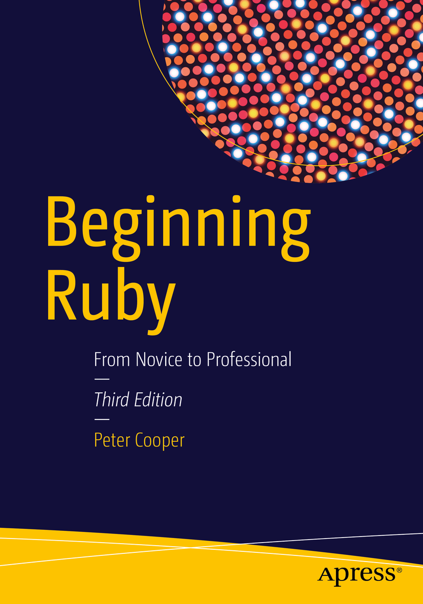

# Beginning Ruby

<!-- toc orderedList:0 depthFrom:1 depthTo:6 -->
<!-- tocstop -->

## info
* publihser http://www.apress.com/gp/book/9781484212790?wt_mc=ThirdParty.SpringerLink.3.EPR653.About_eBook
* github https://github.com/apress/beg-ruby-3ed

## toc
* [Chapter 1: Let's Get It Started: Installing Ruby](Ch01_Lets_Get_It_Started_Installing_Ruby.md)
* [Chapter 2: Programming == Joy: A Whistle-Stop Tour of Ruby and Object Orientation](Ch02_Programming_Joy_A_Whistle-Stop_Tour_of_Ruby_and_Object_Orientation.md)
* [Chapter 3: Ruby's Building Blocks: Data, Expressions, and Flow Control](Ch03_Rubys_Building_Blocks_Data_Expressions_and_Flow_Control.md)
* [Chapter 4: Developing Your First Ruby Application](Ch04_Developing_Your_First_Ruby_Application.md)
* [Chapter 5: The Ruby Ecosystem](Ch05_The_Ruby_Ecosystem.md)
* [Chapter 6: Classes, Objects, and Modules](Ch06_Classes_Objects_and_Modules.md)
* [Chapter 7: Projects and Libraries](Ch07_Projects_and_Libraries.md)
* [Chapter 8: Documentation, Error Handling, Debugging, and Testing](Ch08_Documentation_Error_Handling_Debugging_and_Testing.md)
* [Chapter 9: Files and Databases](Ch09_Files_and_Databases.md)
* [Chapter 10: Distributing Ruby Code and Libraries](Ch10_Distributing_Ruby_Code_and_Libraries.md)
* [Chapter 11: Advanced Ruby Features](Ch11_Advanced_Ruby_Features.md)
* [Chapter 12: Tying It Together: Developing a Larger Ruby Application](Ch12_Tying_It_Together_Developing_a_Larger_Ruby_Application.md)
* [Chapter 13: Two Web Application Approaches: Rails and Sinatra](Ch13_Two_Web_Application_Approaches_Rails_and_Sinatra.md)
* [Chapter 14: Ruby and the Internet](Ch14_Ruby_and_the_Internet.md)
* [Chapter 15: Networking and Sockets](Ch15_Networking_and_Sockets.md)
* [Chapter 16: Useful Ruby Libraries](Ch16_Useful_Ruby_Libraries.md)